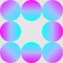

## 境界線

このリポジトリではJavaScriptでDOM操作を行っています。１つ目のtextarea要素にはHTMLのコードが、２つ目のtextarea要素にはCSSのコードがすでに入力されており、最上部にあるプレビュー画面（section要素）にその結果が出力されています。コードは自分でも書き換えることができ、元に戻す際には一番下にある【**リセット**】ボタンをクリックすると最初の画面に戻ります。

iframe要素の内容は上から順に以下の通りとなります。
<br>

### 共通設定

#### HTML

ボーダーを表示させるためのh2要素のHTMLのコードは以下の通りです。

```html
<h2 class="border">...</h2> <!-- "..."は"グラデーション"または"画像"と記述されています -->
```

#### CSS

プレビュー画面（section要素）内の背景を`#000`（黒色）に指定しています。

```css
section.preview {
    background-color: #000;
}
```

プレビュー画面（section要素）内にあるテキスト（h2.border要素）には要素内の余白を`0.5em`空けて`text-align: center;`と記述して画面中央に表示させ、色は`#fff`（白色）に指定しています。

```css
section.preview h2.border {
    padding: 0.5em;
    text-align: center;
    color: #fff;
}
```

これらのCSSの共通設定は、各ディレクトリ内にある`style.css`ファイルに記述しています。

#### 予備

`border-image`プロパティが表示されなかった場合に備え、`border: 30px solid #fff;`と記述して幅が`30px`の`#fff`（白色）の境界線をあらかじめ指定しています。

```css
section.preview h2.border {
    border: 30px solid #fff;
}
```
<br>

### グラデーション

#### HTML

ボーダーを表示させるためのh2要素です。

```html
<h2 class="border">グラデーション</h2>
```

#### CSS

`border-image-source`プロパティには左辺から`#f0f`（紫色）、`#abf`（青みかかった灰色）、`#0ff`（水色）の順番でグラデーションさせた線を表示しています。

```css
section.preview h2.border {
    border-image-source: linear-gradient(90deg, #f0f, #abf, #0ff);
}
```

`border-image-slice`プロパティには省略記述で`1 0`（上下、左右）と指定して上辺と下辺だけを表示させています。

```css
section.preview h2.border {
    border-image-slice: 1 0;
}
```

`border-image-width`プロパティには幅が`15px`の線を表示するように指定しています。

```css
section.preview h2.border {
    border-image-width: 15px;
}
```

#### 一括指定

`border-image`プロパティは一括指定することができます。

```css
section.preview h2.border {
    border-image: linear-gradient(90deg, #f0f, #abf, #0ff) 1 0 / 25px;
}
```
<br>

### 画像

#### HTML

ボーダーを表示させるためのh2要素です。

```html
<h2 class="border">画像</h2>
```

#### CSS

`border-image-source`プロパティには以下の画像を使用しています。



```css
section.preview h2.border {
    border-image-source: url("images/circle.png");
}
```

`border-image-slice`プロパティは上下左右ともに`30`の値で画像（円の模様）をスライスせずに全体を表示させています。

```css
section.preview h2.border {
    border-image-slice: 30;
}
```

`border-image-width`プロパティには上下左右ともに幅を`20px`で表示させています。

```css
section.preview h2.border {
    border-image-width: 20px;
}
```

`border-image-repeat`プロパティには省略記述で`round stretch`（上下、左右）と指定をして上辺と下辺は円の模様を繰り返し、左辺と右辺は真ん中の円の模様を１つだけ縦に引き延ばしたものを表示させています。

```css
section.preview h2.border {
    border-image-repeat: round stretch;
}
```

#### 一括指定

`border-image`プロパティは一括指定することができます。

```css
section.preview h2.border {
    border-image: url("images/circle.png") 30 / 20px round stretch;
}
```
<br>

※ 日本時間 2024/10/15 にリファクタリングしました。
<br><br>

[完成ページへ](https://yscyber.github.io/border/ "https://yscyber.github.io/border/")
